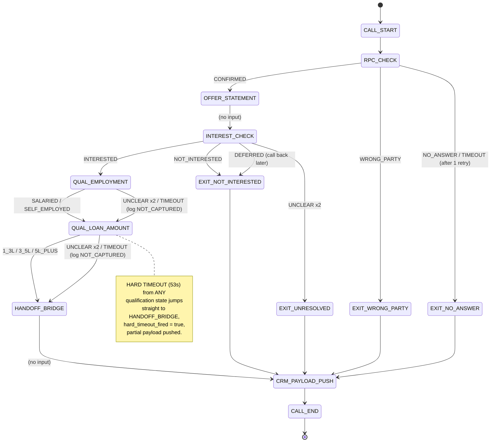

# VOIZ Qualification Layer — Part 1 Technical Artifacts

> These are the **technical scaffolds** for the Part 1 design document: the FSM,
> the state/script/intent tables, the handoff payload schema, the edge-case
> matrix, and the cost math. The **narrative prose** (problem framing, the 3
> success metrics and why you chose them, the risk story) is written by you so
> you can defend every decision in the review call — per the assignment's rules.

---

## 1. Qualification questions — choice & justification (skeleton)

| | Question | Why kept | Order rationale |
|---|----------|----------|-----------------|
| Q1 | **Employment type** (salaried / self-employed) | Hard eligibility filter — lenders gate product & rate on this. Cheap to ask, 2-way classification, robust to STT noise. | Asked **first**: if it disqualifies, you skip Q2 and save call time. |
| Q2 | **Loan amount** (3 buckets) | Ticket size → routing & rep prioritisation. Buckets (not free value) cut STT/number-parsing errors. | Asked **second**: ticket size only matters if eligible. |
| ✂ Dropped | **Purpose** | Open-ended → high STT/time risk, weak signal for rep. | — |
| ✂ Dropped | **Tenure** | Downstream concern the rep sets during the actual application. | — |

*(You write the prose defending this. The cut decision is explicitly scored.)*

---

## 2. Full FSM diagram

### Mermaid (renders on GitHub; paste into mermaid.live to export PNG/SVG)



### ASCII fallback

```
CALL_START
   |
   v
RPC_CHECK --WRONG_PARTY------------> EXIT_WRONG_PARTY ----+
   | CONFIRMED  --NO_ANSWER(x2)----> EXIT_NO_ANSWER ------+
   v                                                       |
OFFER_STATEMENT (no input)                                 |
   |                                                       |
   v                                                       |
INTEREST_CHECK --NOT_INTERESTED----> EXIT_NOT_INTERESTED --+
   |            --DEFERRED---------> EXIT_NOT_INTERESTED --+
   | INTERESTED --UNCLEAR x2-------> EXIT_UNRESOLVED ------+
   v                                                       |
QUAL_EMPLOYMENT --UNCLEAR x2 / TIMEOUT--> (NOT_CAPTURED)   |
   | SALARIED / SELF_EMPLOYED                  |           |
   v                                           v           |
QUAL_LOAN_AMOUNT --UNCLEAR x2 / TIMEOUT--> (NOT_CAPTURED)  |
   | 1_3L / 3_5L / 5L_PLUS                     |           |
   v                                           v           |
HANDOFF_BRIDGE  <------- HARD TIMEOUT @53s from any qual ->|
   |                                                       |
   v                                                       |
CRM_PAYLOAD_PUSH  <------------------------------------------
   |
   v
CALL_END

Every path terminates at CRM_PAYLOAD_PUSH — no undefined exits.
```

---

## 3. State-by-state spec (answers PDF Q6)

For each input-bearing state: **(a)** exact Hindi line, **(b)** intent labels, **(c)** action per label incl. UNCLEAR, **(d)** timeout behaviour.

> ⚠️ **Review the Hindi yourself and make it your own** — naturalness in Tier 2/3
> register is directly scored and you will defend it live.

### RPC_CHECK
- **(a) Hindi:** "Namaste, main QuickLoan se baat kar raha hoon. Kya main {{name}} ji se baat kar raha hoon?"
- **(b) Labels:** `CONFIRMED` | `WRONG_PARTY` | `NO_ANSWER`
- **(c) Actions:** CONFIRMED → OFFER_STATEMENT · WRONG_PARTY → EXIT_WRONG_PARTY · NO_ANSWER → retry once → EXIT_NO_ANSWER
- **(d) Timeout:** ~5 s silence → 1 retry ("Hello, aap sun pa rahe hain?") → still silent → EXIT_NO_ANSWER

### OFFER_STATEMENT *(no input)*
- **(a) Hindi:** "Aapke naam par ek personal loan offer available hai, paisa seedha aapke account mein aa jaata hai."
- Falls straight through to INTEREST_CHECK (no classifier call).

### INTEREST_CHECK
- **(a) Hindi:** "Kya aap iske baare mein thoda aur jaanna chahenge?"
- **(b) Labels:** `INTERESTED` | `NOT_INTERESTED` | `DEFERRED` | `UNCLEAR`
- **(c) Actions:** INTERESTED → QUAL_EMPLOYMENT · NOT_INTERESTED → EXIT_NOT_INTERESTED · DEFERRED → EXIT_NOT_INTERESTED (logged DEFERRED, callback queue) · UNCLEAR(1) → re-ask "Sirf haan ya na — kya aap aur jaanna chahenge?" · UNCLEAR(2) → EXIT_UNRESOLVED
- **(d) Timeout:** treated as UNCLEAR for this state.

### QUAL_EMPLOYMENT *(Q1)*
- **(a) Hindi:** "Bas do choti baatein. Aap salaried job karte hain ya apna business hai?"
- **(b) Labels:** `SALARIED` | `SELF_EMPLOYED` | `UNCLEAR`
  - SALARIED ← job / naukri / service / company / salary
  - SELF_EMPLOYED ← business / apna kaam / dukaan / kheti / contract / freelance
- **(c) Actions:** SALARIED/SELF_EMPLOYED → store → QUAL_LOAN_AMOUNT · UNCLEAR(1) → re-ask "Job karte hain ya apna business — kaunsa?" · UNCLEAR(2) → store `NOT_CAPTURED`, `unclear_count++` → QUAL_LOAN_AMOUNT
- **(d) Timeout:** ~6 s → store `NOT_CAPTURED` → QUAL_LOAN_AMOUNT

### QUAL_LOAN_AMOUNT *(Q2)*
- **(a) Hindi:** "Aap kitna loan soch rahe hain — ek se teen lakh, teen se paanch lakh, ya paanch lakh se zyada?"
- **(b) Labels:** `1_3L` (SMALL ≤3L) | `3_5L` (MEDIUM) | `5L_PLUS` (LARGE) | `UNCLEAR`
- **(c) Actions:** bucket → store → HANDOFF_BRIDGE · UNCLEAR/out-of-range(1) → re-ask "Ek se teen, teen se paanch, ya paanch se zyada lakh?" · UNCLEAR(2) → store `NOT_CAPTURED`, `unclear_count++` → HANDOFF_BRIDGE
- **(d) Timeout:** ~6 s → store `NOT_CAPTURED` → HANDOFF_BRIDGE

### HANDOFF_BRIDGE *(no input)*
- **(a) Hindi:** "Bahut accha, dhanyavaad. Humara representative aapko thodi der mein call karega, please available rahiyega."
- Calls `submit_call_result`, pushes payload, ends call.

---

## 4. Handoff payload schema (answers PDF Q7)

| Field | Type | Value when not captured |
|-------|------|-------------------------|
| `call_id` | string (uuid) | — (always present) |
| `prospect_phone` | string (E.164) | `null` |
| `call_timestamp` | string (ISO-8601) | — |
| `call_duration_seconds` | number | — |
| `rpc_confirmed` | boolean | `false` |
| `interest` | enum `INTERESTED` \| `NOT_INTERESTED` \| `DEFERRED` | `NOT_INTERESTED` (default on early drop) |
| `employment_type` | enum `SALARIED` \| `SELF_EMPLOYED` \| `NOT_CAPTURED` | `NOT_CAPTURED` |
| `loan_amount_range` | enum `1_3L` \| `3_5L` \| `5L_PLUS` \| `NOT_CAPTURED` | `NOT_CAPTURED` |
| `qualification_complete` | boolean | `false` (true only if both qual fields ≠ NOT_CAPTURED) |
| `unclear_count` | number | `0` |
| `hard_timeout_fired` | boolean | `false` |
| `call_terminated_early` | boolean | `false` |
| `rep_priority_score` | number 0–100 | computed (see below) |

**`rep_priority_score`** = `100` − (SELF_EMPLOYED: 5) − (each NOT_CAPTURED field: 20) − (hard_timeout_fired: 10) − (call_terminated_early: 15), floored at 0.

| Scenario | Score |
|----------|-------|
| Salaried, bucket captured, clean | **100** |
| Self-employed, bucket captured | **95** |
| Salaried, loan NOT_CAPTURED | **80** |
| Both NOT_CAPTURED | **60** |
| Hangup mid-call (no tool call) | **45** |

*(Implemented & unit-tested in `src/server/payload-builder.js`.)*

---

## 5. Edge-case matrix (answers PDF 2.3 — 6 mandatory + 2 added)

| # | Edge case | Agent behaviour | What gets logged | Human follow-up? |
|---|-----------|-----------------|------------------|------------------|
| 1 | Out-of-range / nonsense amount | Treat as UNCLEAR for QUAL_LOAN_AMOUNT, re-ask once; then NOT_CAPTURED | `loan_amount_range=NOT_CAPTURED`, `unclear_count++` | Yes — rep re-asks amount |
| 2 | Background noise — STT garbage | Treat as UNCLEAR for current state, re-ask once | `unclear_count++`, field NOT_CAPTURED if 2nd fail | Only if a qual field ends NOT_CAPTURED |
| 3 | Customer switches Hindi → English | Accept English keywords in classifier; agent stays in Hindi | Captured normally (no special flag) | No |
| 4 | "Who are you calling from?" | At RPC: one-line identity ("Main QuickLoan se, aapke loan offer ke baare mein"). During a qual question: treat as UNCLEAR, re-ask the question | `unclear_count++` if mid-qual | No |
| 5 | UNCLEAR twice on same question | Log NOT_CAPTURED, move forward, never ask a 3rd time | `<field>=NOT_CAPTURED`, `unclear_count++` | Yes — rep captures that one field |
| 6 | Hard timeout mid-qualification | At 53 s, jump to HANDOFF_BRIDGE, push partial payload | `hard_timeout_fired=true`, remaining fields NOT_CAPTURED | Yes — partial lead |
| 7 *(added)* | "Call back later" / busy now | Acknowledge, end politely | `interest=DEFERRED`, callback queue | Yes — re-attempt at better time |
| 8 *(added)* | Customer hangs up mid-call | No tool call fires; webhook builds partial payload from call metadata | `call_terminated_early=true`, NOT_CAPTURED fields | Triage by score (≈45) |

---

## 6. Rollback threshold (answers PDF 2.3 closing question)

**Metric to watch:** *qualification completion rate* =
`count(qualification_complete = true) / count(interest = INTERESTED)`
over a rolling window (suggest **last 500 interested calls**).

**Recommended disable threshold:** if completion rate stays **below ~60 %**
(i.e. drop-off > 40 % of interested leads) across the window, revert to pure RPC
handoff.

**Business logic (you write the prose):** below this line the layer is spending
extra call seconds, LLM calls, and TTS cost while handing reps mostly
`NOT_CAPTURED` rows — so it *adds* average handle time and customer friction
without the re-qualification time saving that justifies it. Pick and defend your
exact number; tie it to the rep-time-saved math in §7.

---

## 7. Cost & tradeoff analysis (answers PDF 2.4 — show working)

**Reference rates (verify current):** Deepgram Nova-2 ≈ $0.0043/min · GPT-4o-mini ≈ $0.15/1M input + $0.60/1M output tokens · Sarvam Bulbul-v2 ≈ $0.006/1k chars · ElevenLabs Flash ≈ $0.18/1k chars. FX ≈ ₹83/$.

### Q8 — Incremental cost of the qualification layer (the extra 25 s, 2 LLM calls, extra TTS)

| Component | Working | Cost (USD) |
|-----------|---------|-----------|
| Extra STT (25 s @ $0.0043/min) | 25/60 × 0.0043 | **$0.00179** |
| 2 extra LLM classifier calls (GPT-4o-mini) | ~800 in + 30 out tokens each → (1600/1e6×0.15) + (60/1e6×0.60) | **$0.00028** |
| Extra TTS — **Sarvam** (~450 chars @ $0.006/1k) | 450/1000 × 0.006 | **$0.00270** |
| **Total incremental (Sarvam TTS)** | | **≈ $0.0048 → ₹0.40/call** |
| *(Alt: same TTS on ElevenLabs Flash)* | 450/1000 × 0.18 | *$0.081 → ₹6.7/call* |

**Key lever:** TTS dominates. Sarvam keeps the layer at ~₹0.40/call; ElevenLabs would multiply incremental cost ~15×. (Our live prototype uses Vapi's bundled voice for demo convenience — for production economics, Sarvam is the cost-defensible Hindi TTS.)

### Q9 — Break-even (state assumptions)

Let:
- `c` = incremental cost/call = ₹0.40
- `N` = calls in cohort
- `V` = margin value of one extra funded application (assumption — e.g. ₹X)
- `Δr` = uplift in lead→application conversion from giving reps pre-qualified data

Break-even when: `Δr × N × V ≥ c × N` → **`Δr ≥ c / V = 0.40 / V`**.

Worked example (state your own V): if one extra application is worth **₹2,000** in margin, break-even uplift = 0.40/2000 = **0.02 %** absolute conversion lift. Anything above that pays for itself. *(Plug your real V and defend it.)*

### Q10 — If asked to cut incremental cost 40 % (₹0.40 → ₹0.24)

**Cut first:** TTS characters — shorten scripts and **drop the second retry** on qual questions (the retry is the most expendable TTS+STT spend).
**Tradeoff:** fewer retries → more `NOT_CAPTURED` → lower qualification completion → more rep re-asking. You're trading data completeness for cost. Secondary lever: tighter STT endpointing to shave 2–4 s/call (risk: clipping slow speakers → more UNCLEAR).

---

## 8. Candidate success metrics (formulas only — you choose 3, set targets, justify)

> Targets and the "why over alternatives" are yours. These are just the
> measurement definitions so your numbers are well-defined.

| Metric | Formula | Note |
|--------|---------|------|
| Rep re-qualification time saved | `avg_first_call_AHT(before) − avg(after)` | Ties directly to the stated problem (40–60 % re-qual). Strongest candidate. |
| Lead→application conversion uplift | `apps / qualified_handoffs (after) − baseline` | The revenue metric for break-even. |
| Qualification completion rate | `count(qualification_complete) / count(INTERESTED)` | Also your rollback trigger (§6). |
| Qualification drop-off rate | `1 − completion rate` | Inverse of above; where in the funnel they bail. |
| *(avoid)* Call completion rate, NPS | — | Flagged as vanity metrics in the brief. |
